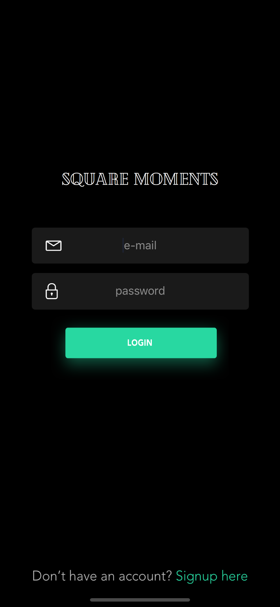
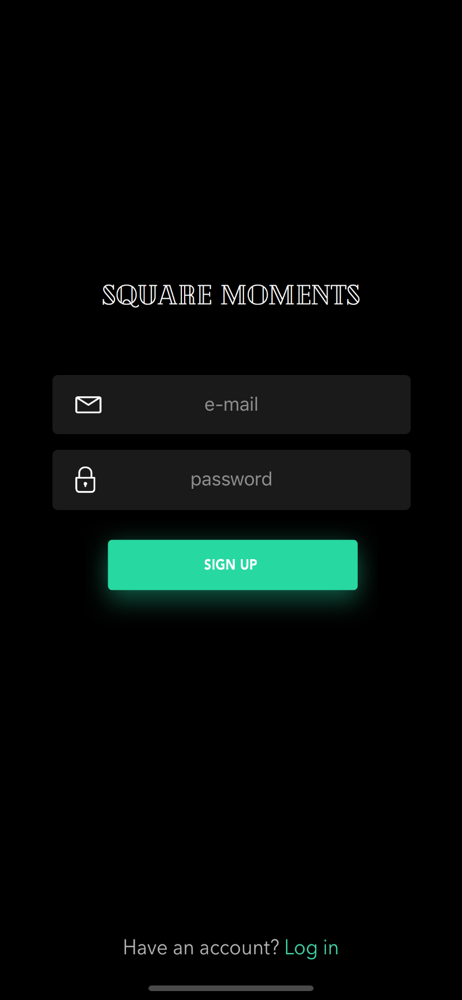
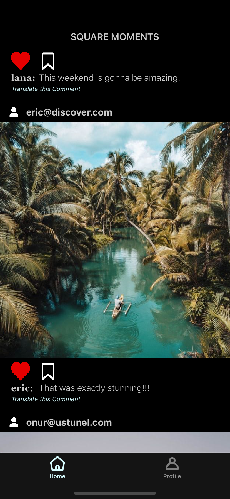
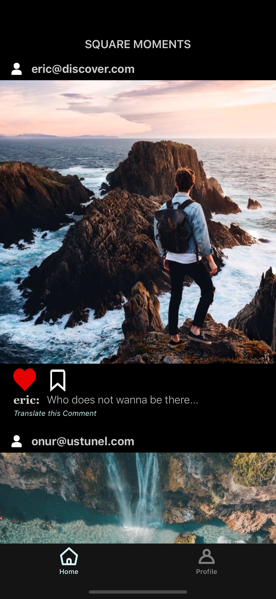
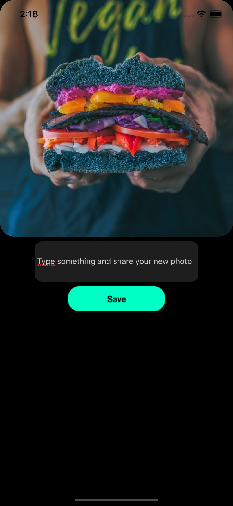

# squareMoments
<h4>SquareMoments is an application to share your best photos like Instagram </h4>

Login Screen 

Signup Screen 

Feed Screen 

Feed Screen 

Profile Screen 

Upload Screen 

<b>  Important Notes:  </b>

Please do not forget to install these pod files.

pod 'Firebase/Analytics'

pod 'Firebase/Auth'

pod 'Firebase/Core'

pod 'Firebase/Firestore'

pod 'Firebase/Storage'

pod 'SDWebImage'

